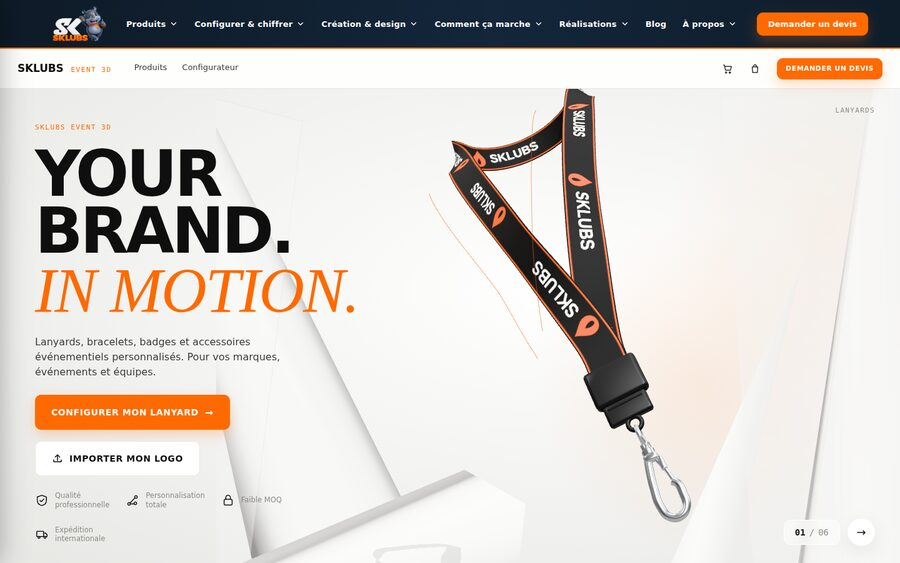
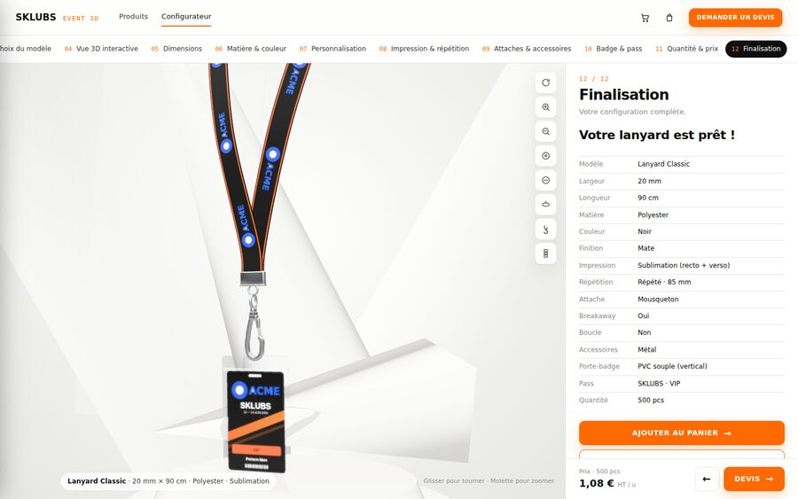
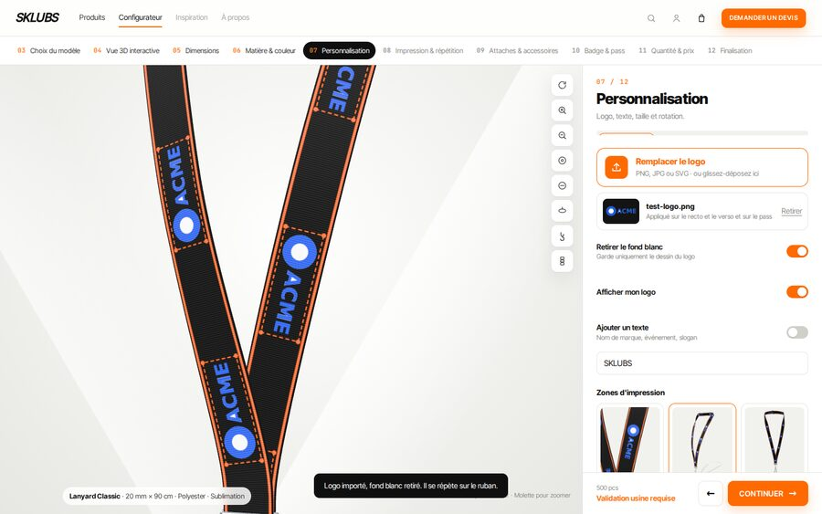
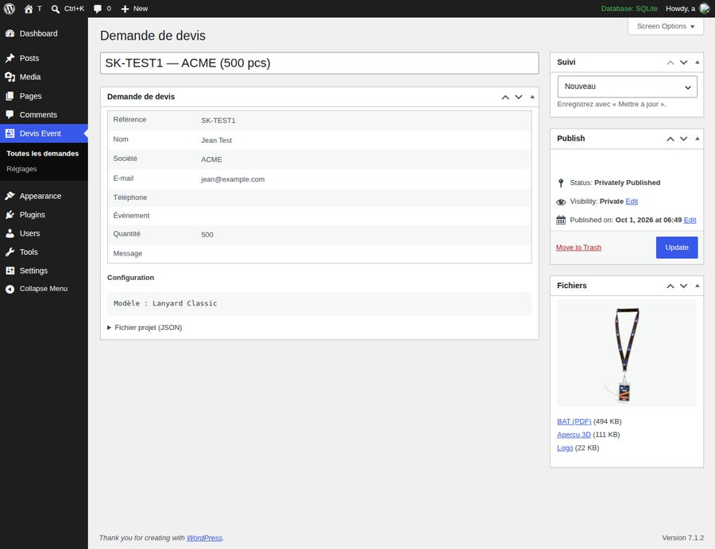
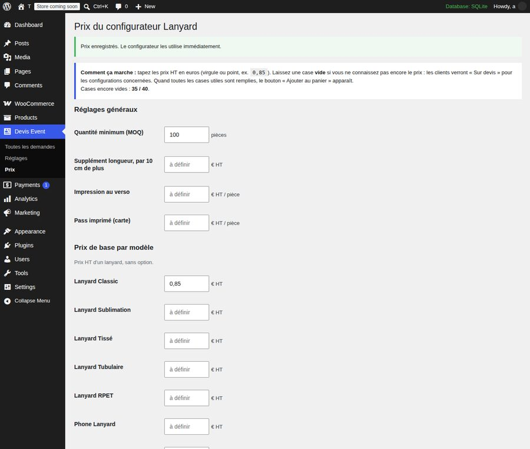
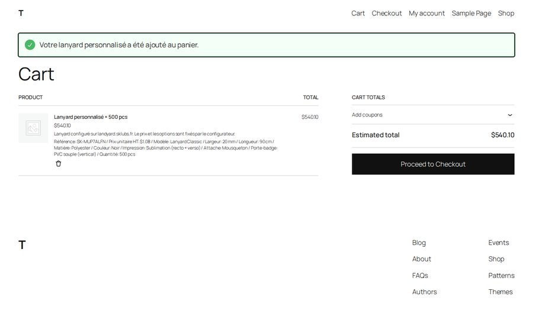

# Guide débutant — le configurateur Lanyard SKLUBS

Ce guide explique, sans jargon, comment marche le configurateur de lanyards, ce que voit le client,
ce que tu reçois, et comment tout mettre en ligne. Il suit le même principe que le configurateur de sacs (bags).

---

## 1. En une phrase

Le client dessine son lanyard en 3D sur **landyard.sklubs.fr**, puis soit il **demande un devis**,
soit il **l'ajoute au panier** de **sklubs.fr** et paie comme pour n'importe quel produit WooCommerce.

```
Client ──► landyard.sklubs.fr (le configurateur 3D, hébergé sur Vercel)
              │
              ├─ « Demander un devis »  ──► sklubs.fr reçoit la demande
              │                               • une commande WooCommerce « Devis demandé »
              │                               • une fiche « Devis Event » avec BAT, logo, aperçu
              │                               • un e-mail pour toi, un e-mail de confirmation pour le client
              │
              └─ « Ajouter au panier »  ──► panier de sklubs.fr ──► paiement WooCommerce
                 (seulement quand tes prix sont saisis)
```

Comme pour bags :
- le configurateur vit sur un **sous-domaine** (`landyard.sklubs.fr`, comme `bags.sklubs.fr`) ;
- il a **le même en-tête et le même pied de page** que sklubs.fr ;
- l'adresse **sklubs.fr/configurateur-de-lanyards-personnalises/** renvoie automatiquement vers le configurateur
  (comme sklubs.fr/configurateur-de-sacs-personnalises/ renvoie vers bags) ;
- c'est **WordPress / WooCommerce qui calcule le prix final**, jamais le navigateur du client.

---

## 2. Ce que voit le client (12 étapes)



| Étape | Ce que fait le client |
|---|---|
| 01 Accueil | Voit le lanyard en 3D, clique « Configurer mon lanyard » ou « Importer mon logo ». |
| 02 Catégorie | Choisit Lanyards (les autres produits sont marqués « Bientôt »). |
| 03 Modèle | Classic, Sublimation, Tissé, Tubulaire, RPET, Phone lanyard, Wrist strap. |
| 04 Vue 3D | Fait tourner le lanyard, zoome, voit les pièces séparées (« vue éclatée »). |
| 05 Dimensions | Largeur (10 à 25 mm) et longueur (70, 90, 120 cm ou sur mesure). |
| 06 Matière & couleur | Polyester, satin, RPET, tissé… et la couleur du ruban. |
| 07 Personnalisation | **Importe son logo**, ajoute un texte, règle taille, rotation, couleurs. |
| 08 Impression | Sérigraphie / sublimation / tissage, recto ou recto-verso, logo répété ou non. |
| 09 Attaches | Mousqueton, crochet, clip, anneau… sécurité à la nuque, boucle détachable. |
| 10 Badge & pass | Ajoute un porte-badge et un pass imprimé à son nom (optionnel). |
| 11 Quantité & prix | Choisit la quantité. Voit le prix, ou « Sur devis » si tes prix ne sont pas saisis. |
| 12 Finalisation | Récapitulatif, puis **Demander un devis** ou **Ajouter au panier**. |



### Le logo du client
- Formats acceptés : **SVG, PDF, PNG, JPG** (15 Mo max).
- Le **fond blanc est enlevé automatiquement** (le client peut le remettre).
- Si l'image est trop petite pour une impression nette, le client est **prévenu** (moins de 150 dpi).
- Le logo se répète tout seul le long du ruban et apparaît aussi sur le pass.



### Le BAT (fichier pour l'usine)
À chaque demande, le configurateur fabrique un **BAT** : le ruban à plat, **à taille réelle**, recto et verso,
avec les mesures, les couleurs et toutes les options. Tu le reçois en **PDF** (pour lire) et en **SVG** (pour l'usine).

---

## 3. Ce que tu reçois quand un client demande un devis

1. **Un e-mail** « [Devis Lanyard] SK-XXXX — nom du client », avec en pièces jointes le BAT, le logo et l'aperçu 3D.
   « Répondre » écrit directement au client.
2. **Une commande WooCommerce** au statut **« Devis demandé »** (WooCommerce → Commandes).
3. **Une fiche « Devis Event »** (menu à gauche dans WordPress) avec tous les détails et les fichiers.



Le client, lui, reçoit un e-mail « Merci pour votre demande de devis SKLUBS (référence SK-XXXX) ».

### Envoyer le prix au client (3 clics)
1. WooCommerce → Commandes → ouvre la commande « Devis demandé ».
2. Sur la ligne « Lanyard personnalisé », écris le **prix total du lot**, puis clique **Recalculer**.
3. Statut → **« En attente de paiement »** → **Mettre à jour**, puis *Actions de commande* →
   **« Envoyer la facture au client »**. Le client reçoit un lien pour payer.

### Suivre tes devis
Devis Event → Toutes les demandes : chaque demande a un **statut** (Nouveau, En cours, Devis envoyé, Gagné, Perdu).
Change-le dans la case « Suivi » à droite, puis « Mettre à jour ».

---

## 4. Mettre tes prix (quand tu les as)

WordPress → **Devis Event → Prix**.



- Tape les prix **HT en euros**, avec une virgule ou un point (`0,85`).
- **Case vide = prix inconnu** : les clients voient « Sur devis » pour les choix concernés. Rien n'est inventé.
- **MOQ** : la quantité minimum. En dessous, le client doit demander un devis.
- **Frais de calage** : montant total par commande, réparti automatiquement sur les pièces.
- **Remises** : par exemple « à partir de 1 000 pièces : 8 % ».
- Clique **Enregistrer les prix** : le configurateur les utilise **tout de suite**.

**Comment le prix est calculé** (pour une pièce) :

```
prix de base du modèle
+ supplément largeur + supplément matière + supplément impression
+ verso (si recto-verso) + attache + breakaway + boucle
+ porte-badge + pass (si choisis)
+ longueur au-delà de la longueur standard
− remise de quantité
+ frais de calage ÷ quantité
```

Quand toutes les cases utiles sont remplies, le bouton **« Ajouter au panier »** apparaît chez le client :



Dans le panier, une seule ligne « Lanyard personnalisé × 500 pcs » avec le détail. Le client paie normalement.
Dans la commande, le lien « Voir le BAT, le logo et l'aperçu 3D » est juste sous la ligne.

---

## 5. Mettre en ligne (une seule fois, ~15 minutes)

### A. Le plugin WordPress (sur sklubs.fr)
1. Récupère le fichier **`wordpress-plugin/sklubs-event-quotes.zip`** (dans le dépôt GitHub `landyard`).
2. WordPress → **Extensions → Ajouter → Téléverser une extension** → choisis le .zip → **Installer** → **Activer**.
3. **Devis Event → Réglages** : écris l'adresse e-mail qui doit recevoir les devis → **Enregistrer**.
4. Vérifie : ouvre <https://sklubs.fr/wp-json/sklubs/v1/ping>. Tu dois voir `"ok":true` et `"woocommerce":true`.

L'activation crée aussi la page **sklubs.fr/configurateur-de-lanyards-personnalises/** qui renvoie vers le configurateur
(connecté en admin, tu vois la page normale pour pouvoir la modifier ; les visiteurs sont redirigés).

### B. Le configurateur sur Vercel
1. Va sur <https://vercel.com>, connecte-toi avec GitHub.
2. **Add New → Project** → choisis **smokersklubs-dot/landyard** → Framework : **Other** → **Deploy**.

### C. L'adresse landyard.sklubs.fr
1. Vercel → ton projet → **Settings → Domains** → ajoute `landyard.sklubs.fr`.
2. **Cloudflare** → sklubs.fr → **DNS** → **Add record** :
   type `CNAME`, nom `landyard`, cible `cname.vercel-dns.com`, **nuage gris** (DNS only).
3. Attends que Vercel affiche « Valid Configuration » (quelques minutes).

### D. Les liens sur sklubs.fr (comme pour bags)
- **Menu** (Elementor → en-tête, ou Apparence → Menus) : dans « Configurer & chiffrer », sous « Configurateur sacs »,
  ajoute un lien **« Configurateur lanyards »** → `https://landyard.sklubs.fr/`.
  (Le menu de l'en-tête du configurateur l'affiche déjà.)
- **Page « Tous les configurateurs »** et pages produits (badges, goodies…) : ajoute un bouton Elementor
  « Configurer mon lanyard » → `https://landyard.sklubs.fr/`, ou le code court
  `[sklubs_lanyard_button text="Configurer mon lanyard en 3D"]`.

### E. Tester
Sur landyard.sklubs.fr : importe un logo, va à l'étape 12, clique **Demander un devis**, remplis ton nom et ton e-mail.
Tu dois recevoir l'e-mail, voir la commande « Devis demandé » et la fiche « Devis Event ».

---

## 6. Problèmes fréquents

| Ce que tu vois | Pourquoi | Que faire |
|---|---|---|
| Le client télécharge un dossier au lieu d'envoyer | Le plugin n'est pas installé ou pas activé | Étape 5-A |
| Pas d'e-mail reçu | WordPress chez Hostinger envoie mal les e-mails | Installer **WP Mail SMTP** et le régler avec ta boîte mail |
| « Origine non autorisée » | L'adresse du configurateur n'est pas dans la liste | Devis Event → Réglages → *Sites autorisés* : `https://landyard.sklubs.fr` |
| Toujours « Sur devis » | Une case de prix est vide pour ce choix, ou la quantité est sous le MOQ | Devis Event → Prix |
| landyard.sklubs.fr ne marche pas | DNS pas encore actif, ou nuage orange | Cloudflare : nuage **gris**, puis attendre |
| La 3D ne s'affiche pas | Vieil appareil sans accélération graphique | Le site affiche un message ; essayer Chrome ou Safari à jour |
| « Trop de demandes » | Plus de 5 demandes en 10 min depuis la même connexion (anti-spam) | Attendre 10 minutes |

---

## 7. Qui fait quoi (pour s'y retrouver)

| Élément | Où | Rôle |
|---|---|---|
| Configurateur 3D | dépôt GitHub `landyard`, publié par Vercel | Ce que voit le client |
| `products/lanyard/product.json` | dans le dépôt | Modèles, matières, couleurs, attaches proposés |
| `site-chrome.js` | dans le dépôt (copie de bags) | En-tête et pied de page sklubs.fr |
| Plugin « SKLUBS Event Quotes » | WordPress sklubs.fr | Reçoit les devis, crée les commandes, gère le panier et les prix |
| Devis Event → Prix | WordPress | **La seule place où tu changes les prix** |
| Devis Event → Réglages | WordPress | E-mail de réception, sites autorisés, accusé de réception |

Une modification du configurateur (texte, couleur proposée…) se fait dans le dépôt GitHub : Vercel remet le site à jour tout seul
à chaque changement sur la branche `main`. Les prix, eux, se changent uniquement dans WordPress.
